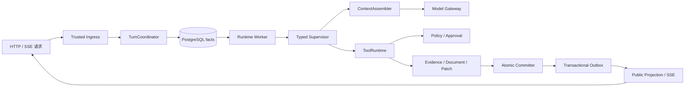
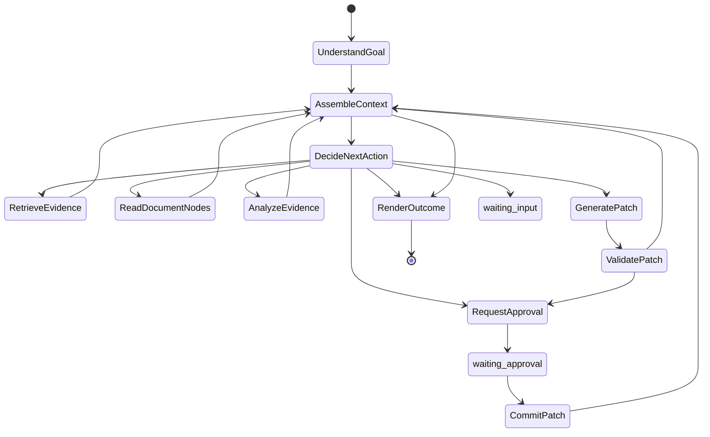
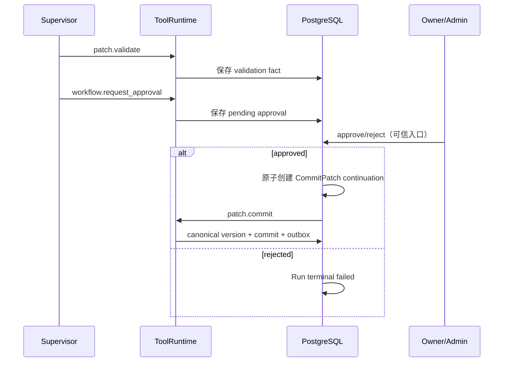

# DocReview Agent Runtime 学习指南

这份文档介绍仓库当前使用的 Agent Runtime。它面向第一次阅读代码、需要调试运行链路，或准备添加工具/节点的开发者。

> 先记住一句话：当前系统不是多个 Agent 自由协作，而是一个由持久化 Run 驱动的、单 Supervisor 类型化状态机。模型负责受约束的语义判断，确定性代码负责状态、权限、工具、审批、文档提交和恢复。

## 1. 先建立心智模型



系统分成三层：

| 层 | 责任 | 关键模块 |
| --- | --- | --- |
| 接入层 | 认证、Workspace/Resource 作用域、请求幂等、SSE 回放 | `server/handlers`、`agent/identity`、`agent/turn` |
| 执行层 | 认领 Step、调用 Supervisor、重试、超时、恢复 | `agent/runtime`、`agent/orchestration` |
| 领域层 | 上下文、检索、文档节点、Patch、审批、投影 | `agent/context`、`agent/tools`、`agent/evidence`、`document/*`、`storage/postgres/*` |

数据库保存不可变或可审计的事实；SSE 连接、内存 channel、React 状态和指标都只是通知或可重建投影。

## 2. 当前生产入口

服务从 [`apps/server/cmd/server/main.go`](../apps/server/cmd/server/main.go) 启动，并在 [`agent_runtime.go`](../apps/server/cmd/server/agent_runtime.go) 装配 Runtime：

1. 加载配置并连接 PostgreSQL。
2. 初始化 Embedding、Reranker 和 LLM Gateway。
3. 初始化 ContextAssembler、EvidenceSet 检索、Canonical Document Committer。
4. 注册类型化工具并创建 ToolRuntime、PolicyEngine、Supervisor。
5. 启动 Durable Runtime Worker 和 Outbox Projection Worker。
6. 创建同一个 Durable Turn Pipeline，注入助手的 HTTP 和 SSE Handler。

`AGENT_RUNTIME_MODE` 当前只接受 `durable`。旧 `legacy` / `shadow` 实现仍在仓库中，但不在 production server 的构造图和路由图中。不要把旧文档 [`multi-agent-task-execution-flow.md`](multi-agent-task-execution-flow.md) 当作当前运行链路。

## 3. 一次请求如何运行

### 3.1 Trusted Ingress 和作用域

请求先由 [`agent/identity`](../apps/server/internal/agent/identity) 验证可信代理提供的身份信息：

- principal type / ID
- organization ID
- workspace ID
- roles
- issued-at 时间
- HMAC signature

签名绑定 `request_id`、HTTP method 和 path，防止把一个请求的身份证明重放到另一个请求。后续每个工具调用都会重新读取并校验 Run、Workspace、Resource 和 principal 事实。

### 3.2 TurnCoordinator 接收请求

[`TurnCoordinator`](../apps/server/internal/agent/turn/coordinator.go) 是 Stream 和 non-stream 共用的请求边界。它会：

1. 清理并校验请求字段。
2. 将消息和作用域编码成 canonical JSON。
3. 计算 `input_hash = sha256(canonical_input)`。
4. 调用存储层的原子 `Accept`。

`Accept` 通常一次事务创建：

- `agent_turns`
- 用户消息
- `agent_runs`
- 第一个 `UnderstandGoal` Step
- 有序 Turn Event
- Outbox Event

相同 scope 下重复使用同一个 `request_id` 会返回已有 Turn；相同 ID 但 input hash 不同会返回幂等冲突。

### 3.3 Durable Worker 认领 Step

Runtime Worker 轮询数据库，使用 `SKIP LOCKED` 风格的 claim 取得可运行 Step。每个 claim 带有：

- `worker_id`
- lease 过期时间
- lease generation
- heartbeat

Worker 崩溃后，过期 lease 会被恢复；旧 Worker 即使晚到，也不能用旧 generation 覆盖新 Worker 的结果。

执行期间还会记录 Attempt，包括 provider、model、prompt version、token、cost、latency、finish reason 和错误分类。

### 3.4 Typed Supervisor 执行图

Supervisor 只接受预先注册的节点类型：



核心代码是 [`agent/orchestration/decision.go`](../apps/server/internal/agent/orchestration/decision.go) 和 [`supervisor.go`](../apps/server/internal/agent/orchestration/supervisor.go)。

Supervisor 的主循环是 `Decide -> Act -> Observe`：

- `DecideNextAction` 让模型从有限动作集合中选择下一步。
- `ActionValidator` 校验动作与节点、工具、前置条件的映射。
- 工具节点通过 ToolRuntime 执行。
- 模型节点通过 Model Gateway 执行。
- 结果被保存为 Observation，状态只保留有界引用。
- 再次组装上下文并继续下一 Step。

模型不能：

- 选择未注册的工具或任意工具版本；
- 跳过 Patch validation；
- 直接创建“已批准”事实；
- 直接提交数据库修改；
- 通过文档或网页中的文字改变系统权限。

### 3.5 ContextAssembler 生成模型可见上下文

[`agent/context/assembler.go`](../apps/server/internal/agent/context/assembler.go) 是唯一的模型上下文组装边界。上下文分层如下：

| Layer | 用途 | 默认预算（装配处） |
| --- | --- | ---: |
| `control` | 系统规则、运行限制 | 1500 |
| `task` | 用户目标和任务状态 | 4000 |
| `working_memory` | 当前图状态和近期观察 | 8000 |
| `evidence` | 检索证据和引用 | 12000 |
| `conversation_memory` | 历史对话 | 5000 |
| `artifact_reference` | 大对象引用 | 2000 |

总预算为 32768 tokens，并预留 4096 个输出 tokens。证据和对话按相关性选择；必需的 control/task 内容超出预算会 fail closed，可选证据则被裁剪。

每次模型调用都会保存不可变 `ContextManifest`，其中包含实际看到的 item、token 数、来源、信任级别、内容哈希和 tokenizer profile。这样可以复现某次 Attempt 的真实上下文，而不是事后重新拼一份“看起来差不多”的 Prompt。

### 3.6 Model Gateway 生成类型化结果

[`agent/orchestration/model_gateway.go`](../apps/server/internal/agent/orchestration/model_gateway.go) 屏蔽具体模型供应商。生产配置使用 SiliconFlow 的 OpenAI-compatible 接口，调用时固定记录：

- provider
- model
- prompt version
- temperature
- trace ID
- expected output contract

不同节点使用不同输出契约，例如 `goal_understanding.v1`、`decision.v1`、`findings.v1`、`patch_input.v1` 和 `outcome.v1`。模型输出必须是严格 JSON object，禁止重复 key、未知字段和尾随 JSON 值。

### 3.7 ToolRuntime 执行工具

工具永远不能被节点直接调用，统一经过 [`agent/tools/runtime.go`](../apps/server/internal/agent/tools/runtime.go)：

```mermaid
flowchart LR
    A[Typed node] --> B[ToolRuntime.Execute]
    B --> C[Registry/version]
    C --> D[Input Schema]
    D --> E[Resource selector]
    E --> F[PolicyEngine]
    F --> G[Approval check]
    G --> H[Rate limit]
    H --> I[Backend]
    I --> J[Output Schema]
    J --> K[Provenance / token bound]
    K --> L[Durable tool audit]
```



每个工具 Descriptor 必须声明：

- 稳定名称和语义版本；
- 输入/输出 JSON Schema；
- 所需权限；
- Resource selector；
- 风险等级；
- 超时与重试策略；
- 幂等模式；
- 最大模型可见结果大小；
- 数据分类。

当前内置工具见 [`agent/tools/builtin/register.go`](../apps/server/internal/agent/tools/builtin/register.go)：

| 工具 | 用途 | 常见风险 |
| --- | --- | --- |
| `document.get_current_version` | 读取当前版本元数据 | Low |
| `document.read_nodes` | 按稳定 node ID 读取 AST 节点 | Low |
| `document.search_nodes` | 在一个授权文档内搜索节点 | Low |
| `retrieval.search` | 生成版本化 EvidenceSet | Low |
| `artifact.read/write` | 读写大对象 Artifact | 视操作而定 |
| `patch.validate` | 确定性校验 PatchSet | Low |
| `patch.commit` | 原子提交已批准 PatchSet | High/Critical |
| `workflow.request_approval` | 创建 pending approval | High |
| `web.search` | 受策略限制的 Web/MCP 搜索 | Low/Medium |

工具错误会归类为 `invalid_input`、`permission_denied`、`not_found`、`conflict`、`rate_limited`、`timeout`、`retryable_upstream`、`terminal_upstream`、`policy_blocked` 或 `cancelled`。只有明确可重试的类别才允许自动重试。

## 4. 证据、文档和 Patch

### 4.1 EvidenceSet

`retrieval.search` 返回结构化 EvidenceSet，而不是一段无法验证的字符串。EvidenceSet 至少绑定：

- Workspace、Resource、Version；
- query 和 query hash；
- evidence/node/content hash；
- lexical、semantic、fused、rerank 分数；
- 检索 profile 和降级信息；
- `untrusted` 信任级别。

Evidence 的作用是给模型提供可引用事实，不是授予权限。网页、用户文档和检索内容都视为不可信输入。

### 4.2 Canonical Document AST

文档修改面向 Canonical Document AST，而不是标题或 substring：

- 节点有稳定 ID、类型、属性、内容和 children；
- 节点保留 source/page mapping；
- Version、AST、Node、Section、Chunk 和 embedding projection 可追溯；
- Patch 操作支持 replace、insert-before、insert-after、delete、update-attributes。

Committer 在写入前再次校验当前版本、base hash、节点关系、Evidence、Workspace、Resource 和幂等键。并发修改会变成 conflict，不会静默覆盖。

## 5. 审批和提交

高风险写入必须经过两阶段：



`workflow.request_approval` 只能创建待审批事实，不能审批自己。批准决定不属于模型或普通工具表面，必须由可信入口中的 owner/admin API 发起，并绑定：

- Workspace；
- Run/Step；
- Tool name/version；
- write idempotency key；
- canonical Resource hash。

重复批准同一决定是幂等的；对同一个 approval 发送相反决定会冲突。

## 6. 状态和恢复

### Run/Turn 状态

公开 Turn 状态包括：

`accepted → running → waiting_input / waiting_approval → running → succeeded / failed / cancelled`

终态不可再次转移。`waiting_input` 和 `waiting_approval` 是持久化等待，不是阻塞某个 HTTP 连接。

### Step/Attempt 恢复

- Step 被 Worker claim 后拥有 lease；
- heartbeat 延长 lease；
- lease 过期后可被其他 Worker reclaim；
- stale generation 的 heartbeat/complete 会被拒绝；
- Attempt 历史保留，重试使用稳定的 Step/Tool 幂等键；
- Run deadline、Step timeout、Attempt timeout、取消和预算由 Engine 统一执行。

### SSE 恢复

SSE 只投影已经持久化的 Turn Event。客户端重连时发送：

```text
X-Request-ID: <same-request-id>
Last-Event-ID: <last-persisted-sequence>
```

服务端重放该序号之后的事件。观察者断开不会取消 durable Run。

## 7. 关键数据表

主要持久化事实及用途：

| 表 | 作用 |
| --- | --- |
| `agent_turns` | 面向用户的一轮请求状态和作用域 |
| `agent_turn_events` | 有序、可回放的公开事件 |
| `agent_turn_outcomes` | 幂等终态结果 |
| `agent_runs` | 一次 durable 执行的预算、状态、作用域和版本 |
| `agent_steps` | 类型化节点、输入、lease、重试和下一步 |
| `agent_attempts` | 每次模型/工具尝试的遥测和错误 |
| `context_manifests` | 模型实际看到的不可变上下文 |
| `tool_calls` | 工具执行审计、幂等和 lease |
| `agent_observations` | 工具/模型观察结果及 content hash |
| `agent_tool_approvals` | 外部审批事实和绑定的 continuation |
| `agent_artifacts` | 超大结果的 Workspace-scoped 外部存储引用 |
| `outbox_events` | 与领域事实同事务写入的异步投影事件 |
| `projection_receipts` | 投影幂等和重放记录 |

迁移文件按阶段递增，主要包括 017 到 024。迁移只应通过 [`cmd/migrate`](../apps/server/cmd/migrate) 和受控数据库环境执行。

## 8. 如何阅读代码

建议按以下顺序阅读：

1. [`cmd/server/main.go`](../apps/server/cmd/server/main.go)：查看生产依赖图。
2. [`cmd/server/agent_runtime.go`](../apps/server/cmd/server/agent_runtime.go)：查看 Runtime、工具和 Worker 的装配。
3. [`server/handlers/assistant.go`](../apps/server/internal/server/handlers/assistant.go)：查看请求如何转换成 Turn Request。
4. [`agent/cutover/durable_runner.go`](../apps/server/internal/agent/cutover/durable_runner.go)：查看同步等待和事件投影。
5. [`agent/turn/coordinator.go`](../apps/server/internal/agent/turn/coordinator.go)：查看请求幂等和 Turn 结果契约。
6. [`agent/runtime/engine.go`](../apps/server/internal/agent/runtime/engine.go)：查看 claim、heartbeat、timeout、retry。
7. [`agent/orchestration/supervisor.go`](../apps/server/internal/agent/orchestration/supervisor.go)：查看每个类型化节点的执行逻辑。
8. [`agent/context/assembler.go`](../apps/server/internal/agent/context/assembler.go)：查看上下文预算和 Manifest。
9. [`agent/tools/runtime.go`](../apps/server/internal/agent/tools/runtime.go)：查看统一工具安全边界。
10. [`document/commit`](../apps/server/internal/document/commit) 和 [`document/validation`](../apps/server/internal/document/validation)：查看 Patch 校验和提交。
11. [`agent/projection/runtime_projector.go`](../apps/server/internal/agent/projection/runtime_projector.go)：查看持久化事实如何变成公开助手消息。

## 9. 如何添加一个只读工具

以“读取某类文档元数据”为例：

1. 在 `agent/tools/builtin` 定义 backend 接口和输入/输出结构。
2. 创建 `agenttools.Descriptor`，写明版本、Schema、权限、Resource selector、风险、超时、重试和结果 token 上限。
3. 实现 `Execute`，只消费已验证的 `agenttools.Call`。
4. 返回结构化 JSON 和完整 provenance。
5. 在 `RegisterCore` 注册。
6. 在 `ActionValidator` 中增加允许的 action → node/tool 映射（只有 Supervisor 节点需要调用时）。
7. 添加失败路径测试：非法 JSON、未知字段、权限拒绝、跨 Workspace Resource、超时、上游错误、输出 Schema、provenance 和重复执行。

只读工具也必须走 ToolRuntime，不能在 Supervisor 中直接调用 backend。

## 10. 如何添加一个写工具

写工具的要求更严格：

1. 输入必须包含稳定的 write idempotency key。
2. 后端必须支持相同 key 重放、不同内容冲突。
3. Descriptor 设置 High/Critical 风险，并声明所需审批。
4. 工具只能创建 pending approval，不能接受模型传来的 `approved: true`。
5. 批准事实必须绑定 Run、Step、Tool/version、Resource hash 和 Workspace。
6. Committer 必须在事务内再次验证当前版本和 expected hash。
7. 领域事实、版本写入和 Outbox 必须同事务提交。

如果一个操作不能做到上述幂等、作用域和恢复契约，就不应接入 Agent Runtime。

## 11. 前端如何消费 Runtime

助手页面调用 `/api/assistant/conversations` 或其 stream 版本；运行监控和审批页面调用：

- `GET /api/agent/runs`
- `GET /api/agent/runs/:id`
- `GET /api/agent/approvals`
- `GET /api/agent/approvals/:id`
- `POST /api/agent/approvals/:id/approve`
- `POST /api/agent/approvals/:id/reject`

运行查询按 Workspace 过滤，并限制状态、Resource 和 limit。查询接口不会暴露完整 ContextManifest、原始模型上下文或敏感工具输入输出，只返回用于诊断的受控摘要。

## 12. 调试思路

遇到一次请求问题时，按以下身份链排查：

```text
request_id
  -> turn_id
  -> run_id
  -> step_id
  -> attempt_id
  -> tool_call_id / context_manifest_id
  -> outbox_event_id / projection_receipt
```

优先检查：

1. Trusted Ingress 是否提供了正确 Workspace、Resource 和签名。
2. Turn 是否因 input hash 冲突而拒绝。
3. Run/Step 是否处于 waiting、lease 过期或预算耗尽。
4. Attempt 的错误分类是 retryable 还是 terminal。
5. ContextManifest 是否存在且 profile/token budget 正确。
6. Tool audit 是否被 policy、approval、rate limit 或 resource ownership 拒绝。
7. Outbox 是否积压、重试或 dead-letter。
8. Projection receipt 是否已存在，避免把幂等重放误判为重复执行。

不要通过手工修改数据库状态来“修复”运行。运维动作应使用 `agent-runtime-ops`，并保留审计事实。

## 13. 测试和安全边界

安全的本地验证优先使用数据库无关测试：

```powershell
go test ./apps/server/internal/config
go build ./apps/server/cmd/server
go vet ./apps/server/...
```

数据库测试只有在同时满足以下条件时才允许连接：

- `ALLOW_DB_TESTS=1`
- `TEST_DATABASE_URL` 明确存在
- 数据库名以 `_test` 结尾
- 主机通过 `TEST_DATABASE_HOST_ALLOWLIST`

测试不能读取生产 `DATABASE_URL` 或仓库 `.env`，也不能对来源不明的数据库执行迁移、DDL、清理或回填。

## 14. 当前边界和学习重点

当前代码已经完成 durable-only 的生产构造和公开入口切流，但以下事项仍属于发布门禁，而不是本地代码默认成立的事实：

- 真实受保护反向代理的 header stripping/HMAC 互操作；
- 历史 Resource 的 Workspace 归属和 Canonical AST 导入/对账；
- PostgreSQL migration 017–024 的授权环境 round trip；
- 多副本 lease、Outbox dead-letter、审批重放和提交幂等的真实 canary；
- 足够的 shadow/durable 评测证据后再物理删除旧模块。

最有效的学习顺序是：先运行一个只读问题，跟踪 `request_id → turn_id → run_id → step_id`；再观察一次检索工具；最后用测试替身演练“Patch validation → approval → CommitPatch”链路。理解这三个场景后，再扩展新工具或节点。

## 15. 设计原则速记

- **事实持久化**：数据库事实优先，内存状态可丢失。
- **确定性边界**：模型提出意图，代码决定能否执行。
- **最小作用域**：每个请求和工具都绑定 Organization/Workspace/Resource。
- **显式审批**：高风险写入必须由外部 owner/admin 决定。
- **幂等优先**：request、tool、approval、commit、projection 都支持安全重放。
- **失败关闭**：缺少身份、Schema、Evidence、版本或权限时拒绝执行。
- **可恢复执行**：lease、heartbeat、retry、outbox 和 receipt 支持崩溃恢复。
- **兼容但不混淆**：旧代码可以暂存，但不应被当作当前生产 Agent 链路。
