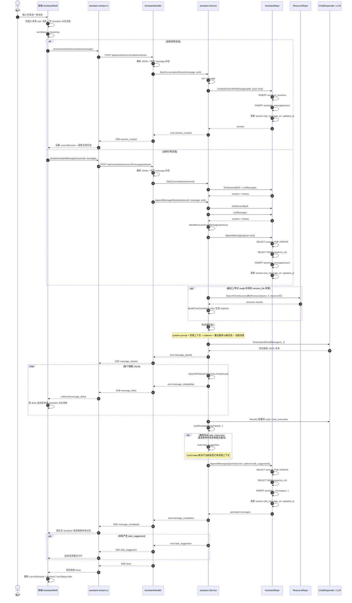
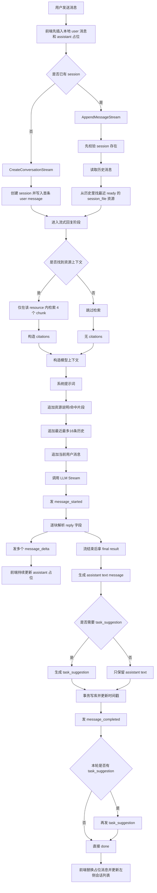

# 助手消息处理流程图

本文描述当前项目中，聊天页收到一条用户消息后的实际执行链路。内容基于当前流式主链路：

- 新会话：`POST /api/assistant/conversations/stream`
- 已有会话续聊：`POST /api/assistant/sessions/:id/messages/stream`

主要实现位置：

- 前端发送与事件消费：`apps/web/components/assistant/assistant-shell.tsx`
- 前端流式 API：`apps/web/lib/api/assistant-stream.ts`
- 路由与 HTTP handler：`apps/server/internal/server/router/router.go`、`apps/server/internal/server/handlers/assistant.go`
- 助手会话服务：`apps/server/internal/assistant/service.go`
- 模型封装：`apps/server/internal/assistant/chat_responder.go`
- 会话持久化：`apps/server/internal/storage/postgres/assistant.go`

## 时序图



## 主流程分支图



## 错误与中断流程

```mermaid
flowchart TD
    A[空消息 / JSON 非法] --> B[handler 直接返回 HTTP 400]
    C[session 不存在] --> D[返回 HTTP 404]
    E[LLM 超时 / 流失败 / 空回复] --> F[后端归一成 StreamError]
    F --> G[SSE error 事件]
    G --> H[前端转成 AssistantTurnError]
    H --> I[finalizeTurnFailure]
    I --> J[保留已生成文本或移除空占位]
    J --> K[追加 local_error 消息]

    L[用户点击停止生成] --> M[AbortController.abort()]
    M --> N[stream 返回 stopped]
    N --> O[前端追加“已停止生成”错误消息]

    P[SSE 没收到 done] --> Q[前端判定流中断]
    Q --> K
```

## 步骤拆解

### 1. 前端发起消息

1. 用户点击发送后，前端会先在本地消息列表里插入一条用户消息。
2. 前端同时插入一条空的 assistant 占位消息，用来承接后续流式增量。
3. 当前状态切到 `streaming`，阻止重复发送。
4. 如果当前没有会话，调用新建会话流接口；否则调用已有会话追加消息流接口。

### 2. 后端接收请求

1. `AssistantHandler` 解析请求体。
2. 如果消息为空，直接返回 `400`。
3. 对续聊接口，handler 会先确认 session 能查到。
4. 然后进入 `assistant.Service` 的流式处理逻辑。

### 3. 新会话与续聊的差异

#### 新会话

1. `StartConversationStream` 先裁剪消息文本。
2. 构造一条用户 `text` 消息。
3. 调用 `CreateSessionWithMessages` 创建 session 并落库首条用户消息。
4. 立即向前端发出 `session_created` 事件，让前端拿到真实 session id。

#### 续聊

1. `AppendMessageStream` 先加载当前 session 和全部历史消息。
2. 从历史中逆序寻找最近一条 `session_file` 且 `status=ready` 的资源消息。
3. 若找到资源，就把它作为当前这轮的资源上下文。
4. 先把本轮用户消息写库，再进入模型流式回复。

### 4. 检索与上下文拼装

1. 只有在会话里存在最近上传成功的资源时，才会走资源检索。
2. 检索范围不是全库，而是限制在该 `resource_id` 内。
3. 当前实现使用 `SearchChunksLexicalByResource(query, 4, resourceID)`，最多取 4 个分块。
4. 检索结果通过 `BuildFromChunks` 转成 citations。
5. 最终喂给模型的内容包括：
   - 系统提示词
   - 当前资源说明
   - 命中的资源片段
   - 最近最多 16 条历史消息
   - 当前用户消息

### 5. 模型流式回复

1. 后端调用 `ChatResponder.Stream(...)`。
2. 模型返回的是 JSON 文本流，服务端不会直接把原始 chunk 透传给前端。
3. 服务端通过 `replyJSONStreamExtractor` 只提取 JSON 中 `reply` 字段的增量文本。
4. 每拿到一段可显示文本，就通过 SSE 发一个 `message_delta` 给前端。
5. 前端收到后，把这段文本追加到本地 assistant 占位消息上。

### 6. 流结束后的落库

1. 流结束后，服务端调用 `Result()` 取最终 `reply` 和可选的 `task_instruction`。
2. 至少会生成一条 assistant `text` 消息。
3. 如果模型明确给出 `task_instruction`，或者用户输入命中任务意图关键词，也会生成一条 `task_suggestion`。
4. `task_suggestion` 是否允许直接创建任务，取决于当前是否已经有明确资源上下文。
5. 这些 assistant 消息通过 `AppendMessages` 一次性写入数据库。

### 7. 前端收尾

1. 前端收到 `message_completed` 后，用数据库里的正式 assistant 消息替换本地占位消息。
2. 如果后端还发送了 `task_suggestion`，前端会把它追加成一张任务建议卡片。
3. 前端必须收到 `done` 才认为本轮完成。
4. 完成后更新当前会话、左侧历史列表，并把状态切回 `idle`。

## 错误处理要点

- 空消息或非法 JSON：HTTP 400
- 会话不存在：HTTP 404
- 模型超时、流失败、空回复：后端转成结构化 `StreamError`，通过 SSE `error` 事件返回
- 用户主动停止：前端 `AbortController.abort()`，最终落为 `stopped`，并追加本地错误提示
- 流正常结束但没收到 `done`：前端按“流中断”处理

## 一句话总结

当前实现的核心链路是：

`前端本地占位 -> SSE 请求 -> 新建或追加 user 消息 -> 可选单资源检索 -> LLM 流式生成 -> assistant 消息落库 -> SSE 回推 completed/task_suggestion/done -> 前端替换占位并完成收尾`
