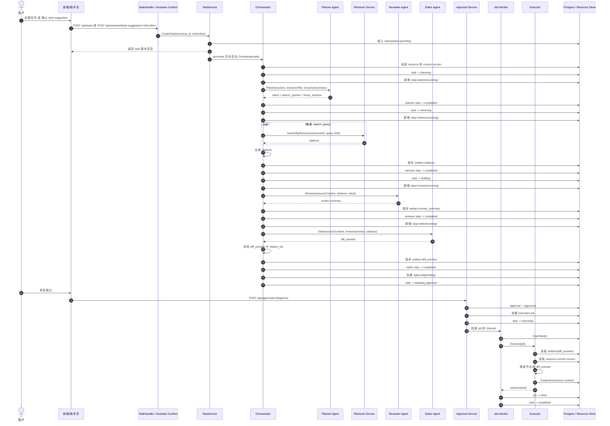
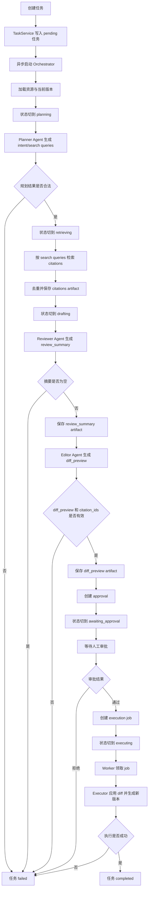
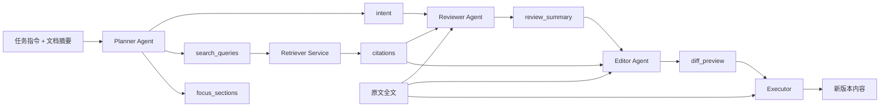

# 多 Agent 任务执行流程图

本文描述当前项目中，任务是如何通过多 Agent 编排、审批与执行完成的。

需要先明确一点：当前实现不是多个 Agent 自由对话协作，而是一个中心编排器按固定阶段顺序调用多个专职 Agent。

当前参与角色如下：

- `planner`：生成任务意图、检索查询、关注章节
- `retriever`：根据规划结果检索证据片段
- `reviewer`：基于原文和证据生成审阅摘要
- `editor`：生成结构化 diff 预览
- `executor`：把 diff 预览真正应用到文档并创建新版本
- `orchestrator`：串联上述阶段并驱动状态流转
- `approval service`：负责审批通过或拒绝
- `job worker`：消费执行作业并触发最终落库

主要实现位置：

- 任务服务：`apps/server/internal/task/service/service.go`
- 编排器：`apps/server/internal/task/workflow/orchestrator.go`
- 多个 Agent：`apps/server/internal/agent/*`
- 审批：`apps/server/internal/approval/service.go`
- 执行 worker：`apps/server/internal/job/worker.go`
- 任务状态机：`apps/server/internal/task/models/task.go`

## 总体时序图



## 编排流程图



## Agent 职责图



## 分阶段说明

### 1. 任务创建阶段

任务入口有两种：

1. 前端直接请求 `POST /api/tasks`
2. 助手会话里确认一条 `task_suggestion`，内部最终也会调用 `CreateTask`

这一阶段只做两件事：

1. 校验 `resource_id` 和 `instruction`
2. 写入一条 `pending` 任务记录，并异步启动编排器

注意：HTTP 请求不会等待整个多 Agent 流程跑完，而是先返回任务记录。

### 2. Planner 阶段

`planner` 是第一个 LLM Agent。

输入：

- 用户任务指令
- 资源标题
- 文档摘要

输出：

- `intent`
- `search_queries`
- `focus_sections`

这个阶段的目标不是直接改文档，而是先把“要改什么”和“去哪找证据”规划清楚。

### 3. Retriever 阶段

这一阶段不是 LLM Agent，而是检索服务。

处理方式：

1. 遍历 Planner 输出的每一条 `search_query`
2. 在当前资源范围内检索相关证据
3. 汇总后去重
4. 存为 `citations` artifact

后续 Reviewer 和 Editor 都依赖这份证据集合。

### 4. Reviewer 阶段

`reviewer` 是第二个 LLM Agent。

输入：

- 文档全文
- citations
- intent

输出：

- 一段纯文本 `review_summary`

它的职责是站在“审阅者”角度指出问题、建议方向和证据充分性，而不是直接生成最终改稿。

### 5. Editor 阶段

`editor` 是第三个 LLM Agent。

输入：

- 文档全文
- `review_summary`
- citations

输出：

- 结构化 `diff_preview`

每个 diff section 需要包含：

- `section_title`
- `original`
- `revised`
- `reason`
- `citation_ids`

编排器会校验 `citation_ids` 是否都来自前面真实检索到的 citations。

### 6. 审批阶段

`planner -> retriever -> reviewer -> editor` 完成后，系统不会直接落盘修改，而是：

1. 创建一条 `approval`
2. 把任务状态切到 `awaiting_approval`
3. 等待用户审批

如果审批拒绝，任务直接进入 `failed`。

### 7. 执行阶段

审批通过后：

1. `approval service` 创建一条 execution job
2. 把任务状态切到 `executing`
3. 把 job 投递给 `job worker`

worker 领取 job 后，调用 `executor.Execute(...)`：

1. 读取 `diff_preview`
2. 读取资源当前版本
3. 按章节标题定位正文
4. 用 `revised` 内容替换对应章节
5. 创建新的资源版本

这里的 `executor` 不是 LLM 推理，而是确定性的版本生成器。

## 当前实现的关键特点

- 多 Agent 是串行编排，不是并行协作
- 只有 `planner`、`reviewer`、`editor` 是 LLM Agent
- `retriever` 是检索服务，不是 Agent
- `executor` 是确定性执行器，不再调用模型
- 单个任务内部按阶段顺序推进
- 不同任务之间可以并发执行，因为 worker 启动了多个 goroutine

## 状态流转

当前任务状态机为：

```text
pending
  -> planning
  -> retrieving
  -> drafting
  -> awaiting_approval
  -> executing
  -> completed
```

任意中间阶段出错，都可以转为：

```text
failed
```

## 一句话总结

当前项目里的“多 Agent 执行任务”本质上是：

`TaskService 异步启动编排器 -> Planner 先规划 -> Retriever 找证据 -> Reviewer 做审阅摘要 -> Editor 生成 diff 预览 -> 人工审批 -> Worker 调用 Executor 生成新版本`
