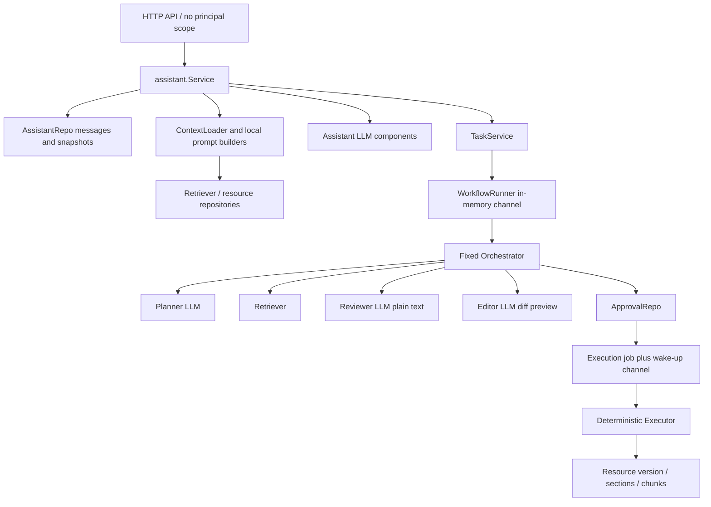
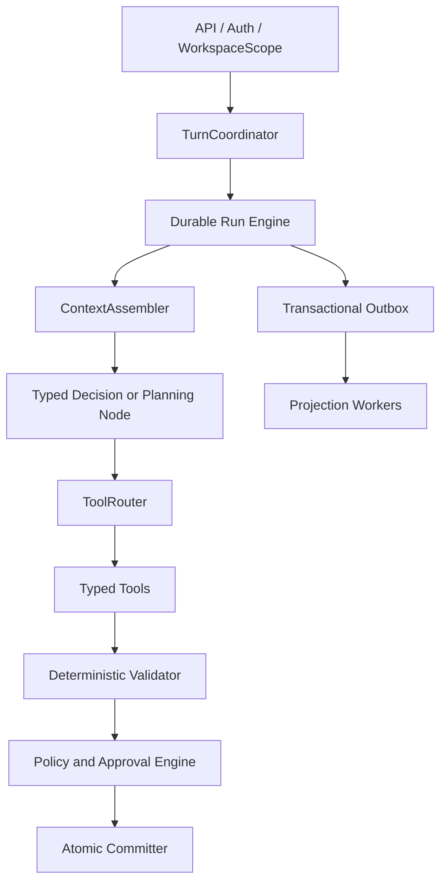
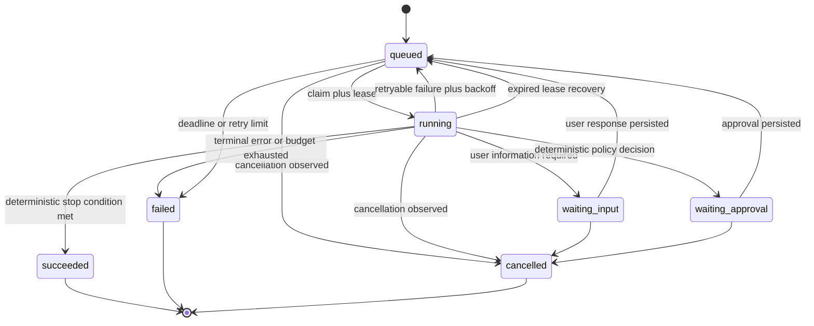

# ADR 0001 — Durable Typed Agent Runtime

- Status: Accepted
- Date: 2026-08-09
- Owners: Agent Runtime / Go backend

## Context and findings

The current product has useful persistence primitives, deterministic approval/execution code, structured assistant messages, task events, grounded resource retrieval, and versioned resources. Those are migration assets, not the final runtime boundary.

The production-critical gaps are:

1. `task/workflow.WorkflowRunner` uses an in-memory `chan string` as the orchestration source of truth. Queue overflow, process exit, or restart can lose runnable work. It has no durable claim, lease, heartbeat, attempt, or stale-running recovery contract.
2. `task/workflow.Orchestrator` hard-codes Planner → Retriever → Reviewer → Editor. Reviewer output is plain text, step execution is not replayable, and model/tool attempts do not have first-class records.
3. `assistant.Service` owns message persistence, context selection, retrieval, model decisions, task suggestions, streaming, non-streaming, and projections. There is no durable `turn_id` or client `request_id` boundary.
4. Context is assembled in several components and constrained partly by rune counts. The system cannot reconstruct the exact context, source, trust, or token allocation seen by a model call.
5. Tool-like operations are direct service dependencies. There is no common registry, JSON Schema validation, policy/risk decision, idempotency, classified error, result budget, or audit protocol.
6. Document edits target Markdown headings/body strings. Existing validation improves safety but does not provide stable node identity, expected-hash conflict detection, authorized-node scope, or an atomic structure/index/outbox commit.
7. Assistant messages and task events are persisted, but projection side effects are not uniformly committed through an outbox. Streaming and background interruption can therefore leave ambiguous partial outcomes.

## Current call, state, and data flow

Current task state is `pending → planning → retrieving → drafting → awaiting_approval → executing → completed`, with `failed` from intermediate states. The workflow row and process-local runner are not a resumable execution log. Assistant messages are the conversation fact source; session snapshots are projections. Resource versions and related structure/index tables are not yet committed through one canonical bundle plus outbox transaction.

## Decision

Adopt one Supervisor with typed execution nodes, typed tools, and deterministic validators. The LLM may understand goals, recommend plans/actions, and generate content. Deterministic Go code exclusively owns authorization, approval, state transition, conflict detection, idempotency, and commit.

The target call path is:

### Runtime state model

Runs, steps, attempts, tool calls, context manifests, approvals, commits, and outbox events are durable facts. A channel or notification may wake workers but never establishes runnable truth.

### Typed orchestration

Initial node types are `UnderstandGoal`, `AssembleContext`, `DecideNextAction`, `RetrieveEvidence`, `ReadDocumentNodes`, `AnalyzeEvidence`, `GeneratePatch`, `ValidatePatch`, `RequestApproval`, `CommitPatch`, and `RenderOutcome`.

Decision output is schema-validated and limited to the accepted action enum. The engine implements Observe → Decide → Validate Action → Execute Tool → Persist Observation → Update State. Deterministic limits stop on success, validated patch, waiting input/approval, max steps/tools, token/cost/deadline exhaustion, repeated no-new-information observations, cancellation, or terminal error.

### Context boundary

Every model invocation uses `ContextAssembler`. It allocates token budgets across control, task, working memory, evidence, conversation memory, and artifact references; reserves output tokens; removes low-relevance evidence before control instructions; and persists the exact `ContextManifest` with provenance, trust, token count, hash, selection reason, and truncation status. Large documents are node references by default.

### Tool and policy boundary

Every tool implements one versioned descriptor and typed execution interface. Input and output are JSON Schema validated. `ToolRuntime` applies discovery, routing, resource-level authorization, risk policy, approval, timeout, retry, rate limit, idempotency, audit, result-size control, provenance, and classified errors. Models cannot create permissions or approval facts. Untrusted document, web, and tool content remains data inside explicit evidence boundaries.

### Document and commit boundary

All importers produce a Canonical Document AST with stable node IDs, attributes, source/page mappings, and metadata. PatchSets address node IDs and expected hashes. The validator checks base version, authorized scope, operation schema, references, and conflicts. The committer atomically creates the new version bundle—canonical structure, sections, chunks, embeddings/profile metadata, resource metadata, idempotency record, and outbox event.

## Module boundaries

New code will be split by responsibility rather than accumulated in `assistant.Service`:

- `internal/agent/runtime`: durable run state machine, worker, leases, retries, budgets, recovery.
- `internal/agent/orchestration`: typed node graph and decision schemas.
- `internal/agent/context`: token budgets and ContextManifest assembly.
- `internal/agent/tools`: registry, router, schemas, execution envelope, error taxonomy.
- `internal/agent/policy`: permissions, workspace/data scope, risk and approval decisions.
- `internal/agent/validation`: deterministic action and PatchSet validation.
- `internal/agent/evidence`: EvidenceSet, provenance, trust and fusion records.
- `internal/agent/memory`: working/conversation memory projections.
- `internal/document/model`: Canonical AST and import/render contracts.
- `internal/document/patch`: PatchSet schema and application.
- `internal/document/commit`: version-bundle transaction boundary.
- `internal/storage/postgres/agentrun`: run/step/attempt/tool/context persistence and claims.
- `internal/storage/postgres/outbox`: transactional event storage, claim and publish lifecycle.

## Database expansion

Add forward-only migrations for `agent_runs`, `agent_steps`, `agent_attempts`, `tool_calls`, `context_manifests`, and `outbox_events`, plus turns/request idempotency and canonical document/Patch commit records. Claims use `SELECT ... FOR UPDATE SKIP LOCKED`, bounded leases, heartbeats, and compare-and-set completion. Unique keys protect `(workspace_id, request_id)`, `(run_id, step_key)`, attempt numbers, tool idempotency, commit idempotency, and outbox publication identity.

No published migration file is edited. Database evolution follows expand → dual write/backfill → verify → switch read → contract. Architecture evolution follows new contract → shadow/dual write → reconcile → switch → remove old path.

## Compatibility and rollout

Use a strangler flag with `legacy`, `shadow`, and `durable` modes. `legacy` remains the initial rollback path. `shadow` persists new turns/runs/manifests and evaluates deterministic decisions without executing duplicate writes. `durable` handles an allowlisted request cohort through the new path. Stream and non-stream HTTP endpoints become adapters over the same Turn Pipeline; SSE only projects persisted turn events.

The first migrated vertical slice is user request → retrieval → analysis → PatchSet → approval → atomic commit. Existing response DTOs and UI event shapes remain adapters until the durable slice passes compatibility tests.

## Legacy removal list

Delete only after durable-mode reconciliation and phase-gate approval:

- `task/workflow.WorkflowRunner` queue as a source of truth.
- Fixed Planner/Reviewer/Editor orchestration and reviewer plain-text protocol.
- Direct LLM/context/tool/commit responsibilities in `assistant.Service`.
- Per-agent prompt/database context assembly.
- Heading/sub-string document patch execution.
- Direct channel-driven approval/job dispatch as execution truth.
- Duplicate stream and non-stream turn orchestration.

## Alternatives rejected

- Adding more role-based agents: increases natural-language handoffs without improving determinism.
- Extending the existing assistant god service: preserves the wrong ownership boundary and makes recovery harder.
- Prompt-only hardening: cannot enforce permissions, idempotency, leases, conflicts, or atomic writes.
- A process-local workflow framework: does not satisfy restart recovery or database audit requirements.

## Risks and mitigations

- Dual-path drift: record comparable decisions and outputs in shadow mode and gate cutover on reconciliation.
- Duplicate writes: require deterministic idempotency keys and database uniqueness at every write boundary.
- Lease races: compare claimed worker and lease generation during heartbeat/completion; test expiry and late completion.
- Migration load: expand with nullable columns/tables and online indexes where needed; do not backfill during schema deployment.
- Tokenizer mismatch: version the estimator/tokenizer with model configuration and persist estimates plus provider usage.
- Large artifacts: store immutable artifacts and give models bounded summaries plus references.
- Prompt injection: treat all evidence as untrusted, schema-bound data and re-authorize every tool at resource scope.

## Rollback

Before read cutover, disable shadow/durable mode and stop new runtime workers; expanded tables remain inert. After cutover, stop claimers, switch routing to legacy for compatible turns, drain/reconcile already committed runs, and retain facts/outbox records for audit. Never roll back by deleting run history, modifying old migrations, or replaying a non-idempotent write.

## Validation gates

Each phase must compile and pass deterministic unit tests without paid models. Database tests run only through the explicit test fuse. Required later gates cover lease recovery, duplicate request/tool calls, timeout hierarchy, cancellation/approval, exact ContextManifest reproduction, schema/policy rejection, prompt injection, AST structure preservation, retrieval degradation, outbox idempotency, interrupted streams, frontend regression, deployment, and rollback.
