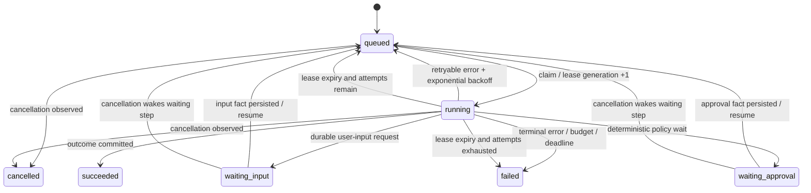
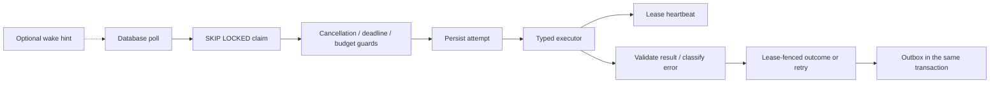

# Durable Run Engine Operations Contract

Phase C implements the durable execution kernel behind ADR 0001. It does not enable the future typed graph for production traffic; the legacy path remains the rollback path while an allowlisted shadow mode records inert runtime facts.

## Runtime state and control flow

The database is the only source of runnable truth. `WorkerConfig.Wake` can reduce polling latency, including when it is absent; a closed wake channel cannot cause busy polling. Workers recover expired leases at startup and periodically while the service remains up.

## Execution safety

- Claims lock one queued step and its run with `FOR UPDATE ... SKIP LOCKED`.
- Heartbeat, retry, and outcome commits require the exact owner, lease generation, and an unexpired lease.
- A step idempotency key is stable across attempts: `agent-step:<step_id>`.
- Retry and outcome commits use deterministic outbox keys. An identical ambiguous-commit replay succeeds only when the matching outbox fact already exists; a stale lease without that fact is rejected.
- Expired lease recovery closes the abandoned attempt with `lease_expired`, then requeues or fails the step according to `max_attempts`.
- Waiting-state resume updates the run and step in one transaction. Cancellation is idempotent and wakes waiting steps so they cannot remain permanently parked.
- Executor output, next-step inputs, error category, usage, and telemetry are validated before persistence.
- Provider, model, prompt version, temperature, context manifest, token usage, internal retry count, cost, latency, finish reason, trace, run, and step are represented by the attempt/run records. Context manifest population is completed by Phase D.

## Timeout and retry hierarchy

The effective attempt context uses the shortest remaining duration among attempt timeout, remaining step timeout from the first start, and remaining run deadline. Attempt timeouts may retry when attempts remain and the retry time precedes the run deadline. Step and run timeouts are terminal. Retry delay is deterministic exponential backoff capped by configuration.

## Budget stops

Before execution, the engine checks maximum steps, maximum tool calls, token budget, and cost budget. Before accepting a continuation, it projects the proposed next steps and the just-recorded token/cost usage and fails closed if the continuation would exceed the run budget. Later ToolRuntime work owns per-tool quota enforcement.

## Strangler configuration

- `AGENT_RUNTIME_MODE=legacy` (default): no new runtime facts are created by the legacy task service.
- `AGENT_RUNTIME_MODE=shadow`: requires `AGENT_RUNTIME_SHADOW_RESOURCE_IDS`, a comma-separated exact resource-ID allowlist. Accepted legacy tasks atomically create an inert run plus `UnderstandGoal` step. Durable execution is not started and shadow failure does not change legacy task availability.
- `AGENT_RUNTIME_MODE=durable`: deliberately fails server configuration in Phase C. Enabling execution before ContextAssembler, ToolRuntime, PolicyEngine, and the typed graph exist would violate ADR 0001.

## Deployment and rollback

Deploy migration 017 through the one-shot checksum migrator before enabling shadow mode. Start with `legacy`, then use `shadow` for a small explicit resource cohort and inspect run/step/outbox facts. No backfill is required.

Rollback is configuration-only: set the mode to `legacy` and restart. Leave additive tables and audit history in place. No legacy read or execution path is switched in Phase C, and no data deletion or reverse migration is required.

## Verification boundary

Database-free tests cover success, deterministic retry, stable idempotency keys, attempt/step/run timeouts, heartbeat, periodic recovery, panic/error classification, cancellation, approval waits, budget stops, malformed node results, worker polling, and the shadow cohort. Guarded PostgreSQL tests cover atomic outcome/outbox, idempotent replay, waiting resume, and retry replay. They skip before connection creation unless the database-test fuse is explicitly satisfied.
