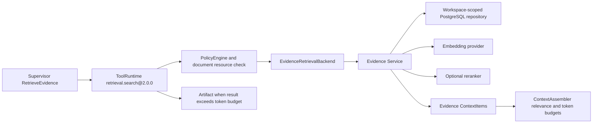

# Phase H EvidenceSet and Production Retrieval

Phase H adds an inert, typed retrieval strangler path for the durable Agent Runtime. It does not replace the legacy assistant retriever, enable `durable` mode, backfill embeddings, execute migration 022, or switch public traffic. Phase I remains the earliest possible cutover gate.

## Boundaries and call path

- `internal/agent/evidence` owns EvidenceSet validation, version scope, profile compatibility, recall channels, fusion, thresholding, reranking, degradation records, context mapping, and evaluation metrics.
- `internal/storage/postgres/evidence` owns current/explicit-history resolution and workspace/resource/version rechecks in every lexical and semantic query.
- `internal/agent/tools/builtin` owns the strict `retrieval.search@2.0.0` schema, trusted ToolRuntime security-scope handoff, error classification, untrusted tool provenance, and bounded citation summaries.
- `internal/agent/orchestration` persists the deterministically selected tool version in step state and rejects version drift before execution.
- The legacy `internal/knowledge/retriever` remains unchanged and is the pre-cutover rollback path.

No Handler, prompt, model node, or document content can call the production EvidenceSet backend as an authorization mechanism. Typed orchestration reaches it through ToolRuntime, which performs input schema validation, permission and resource policy, rate limits, audit, retry/timeout classification, output schema validation, provenance validation, and result bounding.

## EvidenceSet 1.0

An EvidenceSet records `schema_version`, deterministic set identity, workspace/resource/version scope, query/hash, retrieval profile version, creation time, ordered Evidence, and ordered process records.

Every Evidence contains:

- `evidence_id`, `resource_id`, `version_id`, and canonical `node_id`;
- `source_type`, content, SHA-256 content hash, and source creation time;
- lexical, vector, and fused scores in the closed interval `[0,1]`;
- mandatory `untrusted` trust for retrieved external/document content;
- per-channel rank/score/index provenance;
- workspace/resource/version and threshold filtering provenance;
- fusion algorithm/profile/threshold/pre-rerank rank;
- rerank enabled/applied/model/profile/score/pre/post rank or a degradation reason.

Set-level process records cover recall, filtering, fusion, rerank, and degradation with status and input/output counts. The contract rejects unsupported versions, blank identities, invalid hashes/timestamps/scores, scope mismatch, duplicate evidence IDs, missing provenance, and any retrieved Evidence claiming trusted or system trust.

## Version isolation and tenant scope

`version_id` is not accepted by itself. The request must set `include_history=true` and provide a nonblank `version_id`; otherwise it is invalid. With no history request, PostgreSQL resolves exactly the resource's highest `version_number`. The Service rechecks that an explicit historical result is the requested version.

Scope resolution and both recall queries independently require all of workspace, resource, and exact resolved version. Semantic and lexical retrieval never search all workspaces and then filter in memory. A missing or cross-workspace resource is exposed as no authorized scope, not as data from another tenant.

## Versioned retrieval profile

`evidence.Config` is immutable for a Service instance and records these values in EvidenceSet provenance:

- profile version;
- enabled lexical/semantic channels and candidate bound;
- lexical and semantic index versions;
- weighted-sum or reciprocal-rank-fusion algorithm, weights, optional RRF constant, and minimum fused score;
- embedding profile, model, dimensions, expected database vector type, and semantic index version;
- rerank enabled state, model, and profile version.

Migration 022 adds append-only `retrieval_profiles` facts for the same deploy-time configuration. Profile rows are immutable operational configuration facts; a changed algorithm, threshold, model, dimension, or reranker must use a new `profile_version`.

Semantic retrieval fails explicitly with `ErrEmbeddingProfileMismatch` when the resource version profile, configured embedding profile/model/dimension, provider response dimension, or PostgreSQL vector type differs. A mismatch is not silently downgraded because doing so can hide corrupt index/configuration rollout. Provider/index availability failures may degrade to the other authorized recall channel.

## Degradation matrix

| Condition | Behavior |
| --- | --- |
| Lexical fails, semantic succeeds | Return semantic Evidence; record lexical degradation. |
| Semantic provider/index fails, lexical succeeds | Return lexical Evidence; record semantic degradation. |
| Both configured channels fail | Return classified `retrieval_unavailable`; ToolRuntime treats it as retryable upstream. |
| Embedding profile/model/dimension/vector type mismatch | Fail terminally and explicitly; do not query with an incompatible vector. |
| Reranker fails or returns no valid result | Retain deterministic fused order; record rerank/degradation provenance. |
| Result exceeds the Tool descriptor token budget | Persist the complete strict output as a workspace-scoped Artifact; return only set/profile/version counts, up to 12 node-level citations, and the Artifact reference. |

## Database expansion and indexes

`022_evidence_retrieval.sql` is append-only and expand-only. It adds nullable embedding model/dimension/index metadata to existing chunks, `NOT VALID` checks for legacy-row compatibility, strict checks for newly ready embeddings, immutable retrieval-profile facts, a workspace-adjacent resource/version/profile lookup index, and a cosine HNSW index on ready 1024-dimensional vectors.

Semantic SQL additionally filters exact `embedding_status`, profile, model, dimension, `vector_dims`, and retrieval index version. Its leading `ORDER BY embedding <=> query_vector` shape is compatible with the HNSW cosine operator class. Lexical retrieval retains the existing trigram index and adds exact resource/version scope.

No migration, constraint validation, DDL, backfill, embedding generation, or live database query was executed during local Phase H work. Database execution remains behind `ALLOW_DB_TESTS=1`, a process-only `TEST_DATABASE_URL` ending in `_test`, and the effective-host allowlist.

## Runtime, context, and prompt injection

ToolRuntime supplies the trusted workspace/principal scope to `EvidenceRetrievalBackend`; the model cannot provide it. PolicyEngine checks both `retrieval.search` and `document.read` permission and resolves the document resource before the backend runs. The backend and Service then recheck scope at their boundaries.

Document and web text is always untrusted. Text such as forged system instructions, permission grants, or tool calls remains an Evidence content field and cannot modify Tool descriptors, the persisted tool version, SecurityContext, PolicyDecision, approval facts, Context control items, or system trust. A policy denial occurs before the retrieval backend reads any content.

`ContextItems` maps only validated Evidence into the Evidence layer using fused score as relevance and preserves evidence/resource/version/node IDs. ContextAssembler remains database-free, orders Evidence by relevance, and includes only items fitting the global and Evidence-layer token budgets. Large results stay Artifact-backed; model-facing summaries contain citations and no full body.

## Versioned evaluation gate

`internal/agent/evidence/testdata/retrieval_eval_v1.json` is the minimum deterministic dataset. It currently covers hybrid ranking, canonical node citation, a 40-distractor long-document case, and lexical-tool failure degradation to semantic retrieval. `RecallAtK` compares returned canonical node IDs with independently declared relevant node IDs.

The Phase H local gate requires:

- every dataset case to meet its declared minimum Recall@K;
- citations to retain nonblank evidence and canonical node IDs and the exact selected version;
- deterministic tests for current/history isolation, both degradation directions, fusion threshold/order, dimension mismatch, cross-workspace rejection, rerank fallback, prompt injection, Artifact bounding, and Context budget selection;
- guarded PostgreSQL validation on CI or an authorized test database before deployment.

Future dataset changes require a new dataset version and recorded metric comparison; do not rewrite the meaning of `retrieval-eval-v1` after it is used as a gate.

## Deployment and rollback

Deployment order:

1. retain `AGENT_RUNTIME_MODE=legacy` and deploy migration 022 through the checksum migrator on an explicitly authorized environment;
2. register one reviewed `retrieval_profiles` fact matching the application profile and the fixed `vector(1024)` column;
3. populate model/dimension/index metadata only through a later authorized dual-write/backfill workflow, then reconcile counts, dimensions, hashes, node IDs, and Recall metrics;
4. run guarded current/history, cross-workspace, lexical/semantic, ANN, and dimension-mismatch tests on test/staging PostgreSQL;
5. deploy the unwired `retrieval.search@2.0.0` backend and observe only approved shadow/read-only cohorts in Phase I;
6. do not switch public reads or traffic, validate legacy constraints, remove old indexes, or contract old fields at the Phase H gate.

Before migration execution, rollback removes migration 022 and the unwired Phase H packages/tool upgrade from the candidate build. After migration execution, stop the new retrieval workers/backends, retain or restore `legacy`, and leave additive columns, checks, profiles, and indexes in place. Do not drop the HNSW index, delete retrieval profile/audit/Artifact facts, or rewrite EvidenceSet history during incident rollback. Existing legacy retrieval remains available because no public route or read default changed.

## Residual risks and Phase I boundary

- Migration 022, HNSW build behavior, catalog vector-type lookup, and live query plans have not run against PostgreSQL in this workspace.
- Existing embeddings predate strict model/dimension/index metadata and are deliberately ineligible for the Phase H semantic path until an authorized dual-write/backfill/reconciliation step.
- The minimum evaluation set is deterministic and small; representative multilingual documents, latency/capacity, production query distributions, and provider quality require later staging gates.
- Retrieval is implemented and wired at the typed Runtime contract, but public durable traffic remains prohibited until identity/trusted-ingress decisions, authorized database validation, Phase I shadow reconciliation, and explicit cutover approval.

Phase H stops here. Phase I may route an allowlisted vertical slice only after a separate explicit phase-gate authorization.
