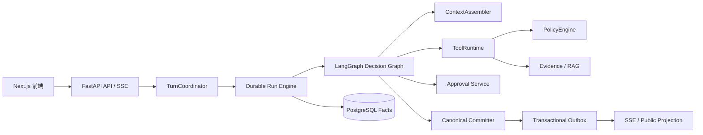

# Python + LangGraph 重写方案

## 1. 文档定位

本文是将当前生产实际使用的 Go 后端能力重写为 Python、并使用 LangGraph 重写 Agent 编排层的实施方案。目标是复刻现有产品行为和可靠性边界，而不是翻译整个 `apps/server` 目录或逐文件改写 Go 语法。

本方案默认：

- 保留 `apps/web` 的 Next.js、React、TypeScript 前端；
- 保留 PostgreSQL 16、`pgvector`、`pg_trgm` 和现有数据库事实模型；
- 保留公开 HTTP API、JSON DTO、错误码、SSE 事件以及 `Last-Event-ID` 语义；
- 当前 Go 生产入口已经是 durable-only；Python 与当前 Go durable 后端在迁移期间并行存在，通过离线对账和入口 canary 逐步切流，不恢复 legacy/shadow 配置模式；
- 不在本方案中执行数据库迁移、历史数据 backfill、生产切流或删除 Go 代码。

当前项目的 Agent 不是普通的 LLM 调用链。Run、Step、Attempt、Tool Call、Approval、Canonical Commit、Outbox、Projection 和 Workspace 隔离都是可审计的持久化事实。LangGraph 只负责图编排，不能取代这些事实和运行控制。

## 2. 重写范围

### 2.1 范围判定规则

重写范围以“当前是否有真实调用方”为准，而不是以目录、包或历史设计文档为准。每一项 Python 实现都必须能追溯到以下至少一种证据：

1. `apps/server/cmd/server` 的生产装配和调用链；
2. `internal/server/router/router.go` 当前注册的公开路由；
3. `deploy/docker-compose.prod.yml`、Server Dockerfile 或部署脚本自动调用的启动/迁移能力；
4. 当前前端 `apps/web` 实际调用的公开契约；
5. durable Run 完成一次真实请求所必需的数据库事务、Worker、工具和投影能力。

`go list -deps` 只能作为包级候选清单，不能单独证明整个包都要重写。最终以生产构造函数、已注册 Handler、实际调用的方法和数据库语义组成的可达闭包为准。测试代码不按文件翻译；Go 测试在迁移期作为行为 oracle，Python 只重建当前行为需要的契约、失败路径和并发测试。

Phase 0 必须生成并评审一份版本化的 active-scope 清单。每条记录至少包含 Go 入口、真实调用方、公开/持久化行为、Python 目标、契约测试和处置方式。没有调用证据的新条目不得进入重写范围。

### 2.2 必须重写的在线能力

- `cmd/server` 当前装配的 FastAPI 等价入口、配置校验、日志、CORS、健康检查和依赖生命周期；
- 当前 Router 已注册的 Resource、Assistant、File、durable Run 查询和 typed Approval 路由；
- assistant session/message 查询、删除、上传和 ingestion 兼容能力，但不迁移已经脱离生产装配的旧 Agent 编排；
- trusted-ingress HMAC、Principal、WorkspaceScope、membership、Resource ownership 和 Policy；
- TurnCoordinator、DurableOnly pipeline、Run/Step/Attempt、ContextManifest、lease、heartbeat、retry、cancel、recover 和 budget；
- 当前 Supervisor/Decision/Model Gateway 的行为，并以 LangGraph 表达其有界编排；
- 当前注册的 ToolRuntime、document/retrieval/Web/Artifact/Approval/Patch 工具及其 Schema、审计、限流和幂等边界；
- Canonical Document、Patch、Validation、Commit、EvidenceSet、pgvector/pg_trgm 检索和安全降级；
- Outbox、Projection Worker、公开 Turn projection、SSE sequence 和 replay；
- 上述在线链路实际使用的 PostgreSQL repository、本地文件存储、Tika、SiliconFlow embedding/reranker/LLM 和可选 MCP Web Search adapter。

### 2.3 部署必需但可延后替换的能力

- `cmd/migrate` 当前被生产 Compose、发布工作流和本地启动脚本自动调用。迁移期间可以继续使用已验证的 Go migrator；最终移除 Go 工具链前，只移植 migration ledger、checksum、advisory lock 和事务语义，复用现有 SQL 文件，不重写已存在的 migration 内容。
- `agent-runtime-ops` 当前随生产镜像发布并有运维手册，但不在在线请求调用链。先保留 Go 二进制；只有运维审计证明仍在使用且最终镜像不能再携带 Go 工具时，才单独迁移其已使用动作。
- `agent-eval` 当前是 CI gate。Python 侧需要建立等价评测门槛，但不要求逐行翻译 Go CLI；可以让 Go gate 在迁移期继续验证基线，待 Python 数据集、scorer 和报告契约成熟后替换。

这些能力不得混入在线服务首批重写，也不得因为最终希望移除 Go 就提前扩大范围。

### 2.4 明确不重写的代码

- 未被 `cmd/server` 构造或 Router 注册的 legacy Task/Job/Approval handler、service、worker 和 workflow；
- 旧 Planner/Reviewer/Editor、固定四段 Agent、legacy assistant deliberation/verifier/summarizer 等已退出生产编排的实现；
- `cutover.Router`、legacy/shadow `Pipeline`、cohort 路由和 legacy fallback；Python 只实现当前 `DurableOnlyPipeline` 行为以及独立的入口 canary；
- 未注册的 `/api/tasks`、legacy `/api/approvals`、`/api/jobs`、task suggestion confirm 和 resource task-context 契约；
- `agent-legacy-report`、`agent-shadow-review`、`resource-reindex`、`inline-material-repair` 等没有被在线服务或自动部署链路调用的 CLI；若后续确认仍有实际运营调用，另立有边界的迁移任务；
- 仅服务于上述未使用模块的 repository、DTO、helper 和测试；
- 已存在但没有生产调用方的实验、兼容分支、历史 shadow/comparison 写路径。

“不重写”不等于立即删除。Go 源码删除仍必须经过 caller/config 审计和现有 removal gate，数据库事实与审计记录不得随代码收缩删除。

## 3. 目标架构



核心调用关系为：

```text
API/Auth/WorkspaceScope
  -> TurnCoordinator
  -> Durable Run Engine
  -> LangGraph: Understand -> Decide -> Act -> Observe
  -> ToolRuntime / PolicyEngine
  -> Evidence / Patch / Approval / Canonical Commit
  -> Transactional Outbox
  -> Public Projection / SSE
```

LangGraph 的 `StateGraph`、节点、边、interrupt 和 checkpoint 只表示 Agent 图的工作状态。业务 Run/Step/Attempt、租约、审批、提交和 Outbox 仍由项目自己的服务和 PostgreSQL 事务管理。

## 4. 技术栈

### 4.1 后端

```text
Python 3.13
FastAPI + Uvicorn
Pydantic v2 + pydantic-settings
LangGraph
Psycopg 3 Async + psycopg_pool
OpenAI Python SDK + httpx
```

FastAPI 负责 REST、文件上传和 SSE。Psycopg 3 Async 负责 PostgreSQL 连接池和事务；`FOR UPDATE SKIP LOCKED`、CTE、Outbox 和复杂状态迁移继续使用参数化、可读、可审计的 SQL。首批不同时引入 SQLAlchemy；只有 active-scope 清单证明 Core 能消除真实复杂度，且经过依赖审批后才可增加。

首批部署保持一个 Python server 进程和一个 Uvicorn worker，由 FastAPI lifespan 启停 Runtime/Projection 后台任务，以复刻当前 Go server 的进程模型并避免多 Uvicorn worker 重复启动 poller。需要水平扩容时，先把 API、Runtime Worker 和 Projection Worker 拆成显式角色并完成多副本 lease/cancel 压测，不能直接增加 `--workers`。

### 4.2 数据和 AI

```text
PostgreSQL 16
pgvector
pg_trgm
Apache Tika
SiliconFlow OpenAI-compatible API
本地内容寻址文件存储
```

保留当前混合检索链路：词法召回、向量召回、融合、阈值过滤、Reranker、citation/provenance 和安全降级。不要在重写时引入 Elasticsearch 或独立向量数据库，也不要让通用 RAG 框架取代现有 EvidenceSet 契约。

### 4.3 工程质量

```text
uv + pyproject.toml + uv.lock
pytest + pytest-asyncio/anyio + Hypothesis
Ruff
Pyright
OpenTelemetry + Prometheus client
structlog 或标准库 logging JSON formatter
Docker Compose + GitHub Actions + GHCR
```

## 5. LangGraph 的责任边界

### 5.1 LangGraph 负责

- `UnderstandGoal`、`AssembleContext`、`DecideNextAction` 等节点编排；
- 有界的 `Understand -> Decide -> Act -> Observe` 循环；
- 类型化 GraphState 的传递和节点路由；
- 工具意图、Evidence、Finding、Patch 等中间结果的图内组合；
- 图层流式事件；
- 在等待外部输入时暂停图，并在批准或拒绝后恢复图；
- 图状态 checkpoint 和受控 replay。

### 5.2 项目自己的服务负责

- Run、Step、Attempt 的生命周期；
- PostgreSQL `SKIP LOCKED` claim；
- owner、lease generation、expiry fencing；
- heartbeat、retry、backoff、timeout、cancel 和 crash recovery；
- Tool Registry、JSON Schema、幂等、审计、限流和 Artifact；
- Principal、WorkspaceScope、Resource ownership 和 Policy；
- Approval 与 Run/Step/Resource/Patch 的绑定；
- Canonical Document AST、Patch Validate 和原子 Commit；
- 事务性 Outbox、Projection、SSE sequence 和 `Last-Event-ID` replay；
- 业务事实、公开 DTO 和回滚。

### 5.3 Checkpoint 规则

推荐实现项目自己的 LangGraph Checkpointer：

- `thread_id` 映射到 `run_id`；
- checkpoint 只保存有限、可序列化的图状态；
- 完整工具结果、文档正文、Evidence 内容和大对象保存到 Artifact/事实存储；
- checkpoint 不能替代 Run/Step/Attempt/Tool/Approval/Commit/Outbox 表；
- checkpoint 写入和 lease-fenced outcome 必须有清晰的事务边界；
- 禁止无限制 `graph.invoke()`，每次执行都受 Step、Tool、Token、Cost 和 Deadline 预算约束。

LangGraph interrupt 恢复可能从被中断节点的开头重新执行，因此节点内的外部副作用必须全部经过幂等的 ToolRuntime 或 Committer。不能在 interrupt 前直接发送邮件、写文档、创建审批或调用不可重放的外部 API。

## 6. 活跃模块映射

| 当前 Go 模块 | Python 目标模块 | 迁移策略 |
| --- | --- | --- |
| `cmd/server` | `docreview.api.main` | FastAPI lifespan 和依赖装配 |
| `internal/config` | `config/settings.py` | 保留环境变量名和 fail-closed 校验 |
| 当前已注册的 `server/router`、`handlers` | `api/routes`、`api/dependencies` | 只迁移下列 active route，保持 DTO、错误和 SSE 协议 |
| `assistant.Service` 的会话/上传兼容职责 | `application/assistant_compat.py` | 不迁移旧 assistant Agent 编排 |
| `agent/turn` | `application/turn_coordinator.py` | 保留 request 幂等、事件和 outcome 事务 |
| `agent/runtime` | `runtime/engine.py`、`runtime/worker.py` | 重建 claim、lease、retry、recover、budget |
| `agent/orchestration` 的当前 Supervisor 调用闭包 | `agent_graph/` | 用 LangGraph 重写 State、Decision、Model Gateway 和 Tool execution |
| 当前注册工具所需的 `agent/tools` | `tools/` | 只保留 Registry、Schema、审计、限流、Artifact 和 active backend |
| 当前 durable 链路所需的 `agent/identity`、`agent/policy` | `identity/`、`policy/` | 保留 HMAC、Workspace、Resource、membership 和 Approval policy |
| 在线链路调用的 `storage/postgres` repository | `storage/postgres/` | 按方法和 SQL 语义迁移，不复制整个 package |
| 当前 ingestion/commit 调用闭包中的 `document` | `document/` | 保留 Parser、Normalize、AST、Patch、Validation、Commit |
| 当前 ingestion/retrieval 调用闭包中的 `knowledge` | `knowledge/` | 保留 Indexer、pgvector/pg_trgm、融合和 Reranker |
| `storage/filestore` | `storage/filestore.py` | 保留在线上传/下载所需的本地内容寻址存储 |
| `outbox`、`projection` | `projection/`、`workers/outbox_worker.py` | 保留持久化事件和 SSE replay |
| `cmd/migrate` | 过渡期继续使用 Go；最终可选 `cli/migrate.py` | 只在移除 Go 工具链前迁移 ledger/checksum/lock，不改写历史 SQL |
| `agent-runtime-ops`、`agent-eval` | 过渡期继续使用 Go | 按实际运维/CI 调用另行决定，不属于首批在线重写 |
| `apps/web` | 不改 | 继续调用兼容 API |

当前必须兼容的路由清单是：

```text
GET     /healthz
OPTIONS /api/*path
GET     /api/resources
GET     /api/resources/:id
GET     /api/resources/:id/export
GET     /api/resources/:id/search
GET     /api/agent/runs
GET     /api/agent/runs/:id
GET     /api/agent/approvals
GET     /api/agent/approvals/:id
POST    /api/agent/approvals/:id/approve
POST    /api/agent/approvals/:id/reject
GET     /api/assistant/capabilities
GET     /api/assistant/sessions
GET     /api/assistant/sessions/:id
DELETE  /api/assistant/sessions/:id
POST    /api/assistant/conversations
POST    /api/assistant/conversations/files
POST    /api/assistant/conversations/stream
POST    /api/assistant/sessions/:id/messages
POST    /api/assistant/sessions/:id/messages/stream
POST    /api/assistant/sessions/:id/files
GET     /api/files/:id/download
```

该清单冻结的是路径、方法和当前公开行为，不意味着同名 Go Handler 文件里的所有方法都要迁移。Phase 0 必须再用 Router 测试和前端调用审计核对一次；后续新增路由必须作为独立产品变更处理。

## 7. LangGraph 图设计

### 7.1 GraphState

GraphState 只放有界工作状态和引用：

```python
class GraphState(TypedDict):
    goal: GoalState
    context_manifest_id: str
    observations: list[ObservationRef]
    findings: list[Finding]
    patch: PatchState | None
    last_decision: Decision | None
    approval_id: str | None
    consecutive_no_progress: int
    stop_reason: str | None
    sequence: int
```

完整 Observation、原始检索内容、文件内容和工具响应必须通过 ID/Hash 引用持久化内容，而不是堆积在 checkpoint 中。

### 7.2 节点

```text
UnderstandGoal
AssembleContext
DecideNextAction
RetrieveEvidence
ReadDocumentNodes
AnalyzeEvidence
GeneratePatch
ValidatePatch
RequestApproval
CommitPatch
RenderOutcome
```

模型输出必须经过 Pydantic 严格解码：拒绝未知字段、重复 JSON key、非法 action、非对象 tool input、空 reason、非法 confidence 和不支持的节点类型。

### 7.3 Tool Graph

LangGraph 节点不得直接调用外部工具实现。统一流程为：

```text
Graph node
  -> ToolIntent
  -> ToolRuntime
  -> Schema validation
  -> Resource extraction
  -> Policy / Approval check
  -> idempotent audit claim
  -> backend execution
  -> output/provenance validation
  -> Artifact persistence
  -> typed observation
```

这样可以避免某个 LangGraph 节点绕过 Workspace 隔离、限流、审批或工具审计。

### 7.4 Approval 和 Commit

审批流程：

```text
LangGraph RequestApproval
  -> ApprovalService 创建绑定 Approval
  -> Run/Step = waiting_approval
  -> 外部 owner/admin approve 或 reject
  -> Durable Runtime 事务性唤醒
  -> 从 checkpoint 恢复 LangGraph
```

批准后，Commit 节点只提交经验证的 PatchSet。Canonical Commit 必须在一个数据库事务中重新校验 Workspace、Resource、版本、base hash、Patch hash、结构和幂等键，并同时写入版本、派生投影、Commit fact 和 Outbox。

## 8. 迁移阶段

### Phase 0：契约冻结

- 生成 active-scope 清单，记录生产入口、调用方、Python 目标、测试和“不迁移/保留 Go/迁移”决策；
- 对 `cmd/server` 构造图、Router、前端 API 调用、Docker/Compose/CI/部署脚本做调用方审计；
- 固化 API、DTO、错误码、SSE event type、sequence 和 `Last-Event-ID`；
- 固化环境变量、配置 fail-closed 规则和数据库 migration checksum；
- 建立 Go/Python contract fixtures；
- 对每个候选模块执行反向检查：删除该 Python 候选是否会破坏一条 active contract；若不会，则移出范围；
- 不修改公开语义和数据库字段，Phase 0 评审通过前不得开始批量实现。

### Phase 1：Python 基础服务

- 建立 `apps/server-python`、`pyproject.toml`、`uv.lock`；
- 实现 FastAPI lifespan、配置、日志、CORS、HMAC ingress、健康检查；
- 接入 Psycopg 连接池和安全测试数据库 fuse；
- 实现 active route 中的健康检查和只读 Resource、Run、Approval 查询；
- 保持 Next.js 无感访问。

### Phase 2：Storage、文档和 RAG

- 只按 active 方法和事务边界迁移 PostgreSQL adapter；
- 迁移本地内容寻址文件存储；
- 迁移 Tika、Markdown、DOCX/PDF 解析边界；
- 迁移 Canonical AST、Node Patch、Validation、Commit；
- 迁移 pgvector/pg_trgm 混合检索和 EvidenceSet；
- 与 Go 对比查询结果、引用和 hash。

### Phase 3：Durable Runtime

- 迁移 Run/Step/Attempt/Tool/ContextManifest/Outbox repository；
- 实现 claim、lease、heartbeat、retry、backoff、timeout、cancel、recover；
- 实现稳定 Step/Tool/Commit 幂等键；
- 实现 lease-fenced outcome 和事务性 Outbox；
- 注入 crash、过期 lease、重复提交和 stale worker 测试。

### Phase 4：LangGraph 编排

- 实现 Pydantic domain schemas 和 GraphState；
- 将当前 server 构造的 Decision、Supervisor、Model Gateway、RuntimeToolExecutor 行为迁移到 LangGraph；
- 实现项目 Checkpointer 适配器；
- 对接 ContextAssembler、ToolRuntime、Evidence、Approval、Commit；
- 先离线运行，不接公共流量。

### Phase 5：Turn、API 和 Projection

- 迁移 TurnCoordinator、assistant session/message projection；
- 迁移非流式和 SSE 共用的 durable pipeline；
- 保持 stream/non-stream 收敛到同一批持久化事件；
- 支持断线后按 `Last-Event-ID` 回放；
- 迁移 `/api/agent/runs*`、`/api/agent/approvals*` 和助手端点。

### Phase 6：离线对账和入口 Canary

- 先用固定 fixture/数据库快照离线运行 Go 与 Python，比较决策、工具、Evidence、Patch、公开 DTO 和 SSE；
- 不重建旧 `AGENT_RUNTIME_MODE=shadow`、legacy runner 或生产双写链路；需要持久化差异时复用现有 comparison fact 契约或生成离线报告；
- 入口 canary 按明确 Resource/Workspace cohort 为单次请求只选择 Go durable 或 Python durable 一个权威写入方；
- durable canary 期间演练审批、拒绝、重复决定、SSE 断线、Worker 恢复和回滚。

### Phase 7：切流和收缩

- 通过受保护入口切换 Python durable 流量，不扩展应用内 `AGENT_RUNTIME_MODE`；
- 保留 Go 版本作为已验证回滚 release；
- 每次只删除一个旧模块，并重新审计生产 caller/config；
- 通过 removal gate 后再考虑 Schema contract/drop；
- 禁止把代码删除和数据库收缩放在同一次变更中。

## 9. 测试和验收门槛

### 9.1 单元和契约

- Graph node、Decision schema、Action validator、Tool schema 全部有成功和失败路径；
- API JSON、SSE、错误码和分页契约与 Go 对比；
- checkpoint 序列化拒绝不可控对象和超大状态；
- 模型 provider 错误、超时、空输出、非法 JSON 和 token/cost 超限有测试。

### 9.2 Runtime 和数据库

- Run/Step/Attempt 创建和 replay 幂等；
- Tool claim、lease、heartbeat、retry、dead-letter 和 stale worker fencing；
- Approval approve/reject/重复决定和等待恢复；
- Canonical Commit 的 hash 冲突、版本冲突、结构校验和原子回滚；
- Outbox claim、发布、retry、dead-letter、receipt 和重复发布；
- 跨 Workspace/Resource/Principal 隔离。

数据库测试继续遵守仓库保险丝：只读取 `TEST_DATABASE_URL`，必须同时满足 `ALLOW_DB_TESTS=1`、数据库名以 `_test` 结尾、host 在 `TEST_DATABASE_HOST_ALLOWLIST`，且不得回退 `DATABASE_URL` 或 `.env`。

### 9.3 Agent 评测

至少覆盖：

- citation correctness；
- node targeting；
- edit fidelity；
- Prompt Injection；
- 长文档和超预算；
- interrupted stream；
- retry 和 crash recovery；
- approval/commit 一致性；
- 跨 Workspace 隔离；
- provider 降级和 reranker 失败。

继续使用版本化 evaluation dataset，并记录 provider、model、prompt version、token、cost、latency、retry、trace 和 ContextManifest。

## 10. 切流、回滚和删除门槛

切流顺序：

```text
Go durable production
  -> Python read-only
  -> Go/Python offline parity
  -> Python durable canary
  -> Python durable production
  -> 单个 Go active module 删除
```

入口 canary 必须单写：同一 `request_id` 只能由 Go 或 Python 接受并产生权威 durable 事实，禁止为了对账而让两边同时执行 Tool、Approval、Commit 或 Outbox 写入。回滚时停止向 Python 分配新请求，让 Python 已接受的 Durable Run 和 Outbox 排空，再把入口全部切回已验证的 Go durable release。不得删除 Run、Step、Attempt、Tool、Approval、Commit、Outbox、Projection、Comparison 或 operator audit 事实。

Python 切流和 Go 删除沿用现有可靠性门槛，并增加 active-scope 审计：

- 至少 100 条人工复核的离线或只读 parity comparison；
- 匹配率不低于 99%，不可用率为 0%；
- 至少 20 个 durable cohort Run，成功率不低于 99%；
- projection dead letter 和 retrieval profile mismatch 为 0；
- PostgreSQL round trip、protected ingress、durable canary 已授权并完成；
- crash recovery、request/tool/commit 幂等、审批、提交和 Workspace 隔离已验收；
- active-scope 清单中的条目全部有 Python 实现或经评审的继续使用 Go 决策，清单外 Go 包没有被 Python 在线服务意外依赖；
- 目标旧模块的生产 caller 和配置依赖为 0。

“Python 服务能启动”不构成切流或删除资格。

## 11. 风险和未决事项

- LangGraph checkpoint 与业务事实双写可能产生一致性问题，必须先定义事务边界和恢复策略；
- LangGraph 节点 replay 可能重复调用外部服务，所有副作用必须经过幂等边界；
- Python 异步 Worker 的连接池、取消和超时语义需要压力测试；
- 现有历史 Resource 可能缺少 Workspace 或 Canonical AST，正式切换前必须完成受控 importer/backfill/reconciliation；
- DOCX/PDF 当前能力依赖 Tika 和确定性 extractor，需使用代表性 fixture 对账；
- SiliconFlow 真实模型质量、延迟、容量和费用需要 staging/canary 证据；
- Go package 粒度比实际调用范围大，若不冻结 active-scope 清单，容易把已退出生产的 legacy helper 和 CLI 误带入 Python；
- 是否采用 Temporal 等外部 durable workflow 平台不在本方案范围内，除非单独评审基础设施、成本和回滚影响；
- 最终身份提供商和公开认证协议仍需单独决策，当前 trusted-ingress adapter 不能被误认为完整身份系统。

## 12. 推荐实施原则

1. LangGraph 决定“下一步做什么”，项目 Runtime 决定“什么时候运行、谁可以运行、是否可重放”。
2. PostgreSQL 是 Run、Step、Tool、Approval、Commit 和 Outbox 的事实来源；内存状态、Graph stream 和 UI 状态都是可重建投影。
3. 只迁移生产可达行为；Go 文件、package 或测试的存在本身不是重写理由。
4. 先冻结契约和 active scope，再离线对账，再做入口单写 canary，最后删除旧路径。
5. 保持每个阶段独立可验证、可回滚，不进行跨多个领域的机会性重构。
6. 未满足授权数据库、受保护入口、canary 和 removal gate 前，不执行真实 backfill、破坏性 migration、生产切流或旧代码删除。

## 13. 参考资料

- [LangGraph overview](https://docs.langchain.com/oss/python/langgraph/overview)：图编排、持久化、流式和 human-in-the-loop 的官方能力边界。
- [LangGraph persistence](https://docs.langchain.com/oss/python/langgraph/persistence)：checkpoint、thread、replay 和持久化存储说明。
- [LangGraph interrupts](https://docs.langchain.com/oss/python/langgraph/interrupts)：暂停、恢复以及副作用幂等要求。
- [`agent-runtime-final-architecture.md`](./agent-runtime-final-architecture.md)：当前项目最终运行时架构和 legacy removal gate。
- [`durable-runtime-engine.md`](./durable-runtime-engine.md)：当前项目 Run/Step/Attempt、lease、retry 和 recovery 契约。
- [`typed-orchestration.md`](./typed-orchestration.md)：当前类型化 Decision、Supervisor、Evidence、Patch 和 Approval 边界。
