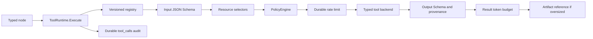

# ToolRuntime and Tool Development Contract

This document specifies the Phase E execution boundary for every Agent tool. It implements the Tool and policy section of [ADR 0001](./decisions/0001-durable-typed-agent-runtime.md). The legacy assistant path remains active; Phase F typed orchestration will be the first consumer of this runtime.

## One execution path

No node, handler, prompt builder, or tool backend may bypass `ToolRuntime.Execute`. A backend receives already schema-checked input but must still apply its domain invariants. Backends do not grant permissions, persist their own tool-call audit row, or infer approval from model content.

## Tool contract

Implement `tools.Tool` with an immutable descriptor and an execution method. Register an explicit semantic version. Names are stable, lowercase domain actions such as `document.read_nodes`; changing an input/output contract requires a new version.

A descriptor must declare:

- JSON-object input and output schemas;
- required permissions and resource selectors;
- risk level, timeout, retry policy, and idempotency mode;
- maximum model-facing result tokens and data classification.

The built-in fail-closed schema validator supports the documented object, array, scalar, required/property, additional-property, enum/const, numeric, length/item, and pattern constraints. An unsupported keyword rejects registration. This intentionally avoids an unapproved production dependency; adding full Draft 2020-12 support requires a reviewed dependency decision and compatibility tests.

Write tools must use `IdempotencyRequired`, accept a caller-generated stable key, and persist through a uniqueness constraint or equivalent compare-and-return contract. Retrying the same key with different content must return `conflict`.

## Policy and approval

`policy.Engine` checks a trusted principal/workspace scope, every declared permission, and every extracted resource before execution. PostgreSQL resolvers fail closed for unknown resource types and enforce workspace ownership at the resource table, not only at the API layer.

High and critical risk calls require an approved external fact bound to all of:

- workspace;
- run and step;
- tool name and version;
- write idempotency key;
- canonical resource set hash.

`workflow.request_approval` can only create a pending request for its current run and step. It cannot decide one. `ApprovalStore.DecideApproval` is deliberately outside the Tool registry, accepts only authenticated user scope, and requires an active admin or owner membership. Model output, a payload field such as `approved: true`, or an untrusted document/web instruction is never an authorization fact. Request and decision events are committed to the outbox in the same transaction.

Approval request calls and target writes use separate idempotency domains. The request call key replays `workflow.request_approval`; `ApprovalInput.idempotency_key` binds the future high-risk write. Reusing one key across both tools is forbidden by the run-level tool-call uniqueness contract and would prevent the approved commit.

## Runtime behavior

The runtime performs, in order: durable audit claim/replay, required-idempotency validation, input schema validation, resource extraction, policy/approval, durable rate limit, attempt timeout/retry, output schema and provenance validation, and result bounding.

Only `rate_limited`, `timeout`, and `retryable_upstream` are retryable. Backoff is bounded exponential and attempts stop at the descriptor maximum. Parent cancellation is `cancelled`; an individual deadline is `timeout`. Unknown errors and output/provenance violations are `terminal_upstream`.

The complete error taxonomy is:

- `invalid_input`
- `permission_denied`
- `not_found`
- `conflict`
- `rate_limited`
- `timeout`
- `retryable_upstream`
- `terminal_upstream`
- `policy_blocked`
- `cancelled`

Every nonempty result has provenance. External documents, retrieval results, and web pages are `untrusted`; storage mutation receipts may be `trusted`. Content that exceeds `MaxResultTokens` is written to a workspace-scoped `agent_artifacts` row and replaced with a bounded summary plus `artifact://` reference. `ContextAssembler` and ToolRuntime share the same injected tokenizer through `context.JSONTokenCounter`.

## Tool-call crash recovery and audit

`tool_calls` is the execution fact source. The PostgreSQL audit store creates or claims a call with owner, lease expiry, and lease generation. An expired running call may be reclaimed; a stale worker cannot finish after a newer generation. Terminal calls replay their classified result without re-execution. The worker/step lease remains the outer execution boundary; an in-memory notification never creates runnable truth.

The audit row records tool/version, input/output, status, idempotency key, classified error, attempt count, latency, start, and completion. Phase F must pass run, step, trace, security scope, approval ID, and a deterministic idempotency key from the typed node state.

## Web search provider contract

Web search performs sensitive-query screening before provider I/O, applies an allowed-domain policy to returned URLs, uses durable per-workspace/principal/tool quotas, and stores audit/provenance through ToolRuntime. Provider configuration must explicitly state both `mock|production` and the expected provider name. A response with a different name is rejected, so the current mock MCP sidecar cannot masquerade as production.

The existing MCP provider is used only through `builtin.ProviderWebBackend`, which converts provider failures to the ToolRuntime taxonomy and forwards `trace_id`. External text stays inside an untrusted result envelope even when it contains forged system or administrator instructions.

## Built-in registry

Phase E defines adapters for:

- `document.get_current_version`
- `document.read_nodes`
- `document.search_nodes`
- `retrieval.search`
- `web.search`
- `artifact.read`
- `artifact.write`
- `patch.validate`
- `patch.commit`
- `workflow.request_approval`

Document, retrieval, and patch backends are typed interfaces at this gate. Phase G/H will implement canonical AST/Patch and EvidenceSet persistence behind them; they must not be advertised as production-ready before that wiring exists.

## Migration, deployment, and rollback

Migration `019_tool_runtime_controls.sql` is expand-only. It adds recoverable lease fields to `tool_calls`, durable artifacts, bound approval facts, and durable fixed-window rate-limit buckets. Run it only through the offline migration command after its ledger checksum is recorded. No migration or database integration test was executed during local Phase E verification without an explicitly authorized `_test` database.

Before migration execution, rollback is removal of the unwired Phase E packages and migration from the candidate build. After execution, retain the additive audit/artifact/approval/quota tables, keep `AGENT_RUNTIME_MODE=legacy`, and stop new runtime workers. Do not delete audit or approval facts in an emergency rollback.

## Required tests for a new tool

Add deterministic tests for valid input/output, malformed and trailing JSON, unsupported schema, permission/resource denial, approval binding for high risk, timeout, retryable and terminal errors, cancellation, idempotent replay/conflict, oversized output, missing/invalid provenance, sensitive query/data handling, and backend failure classification. Database round trips must use only the shared R0.1 test fuse.
