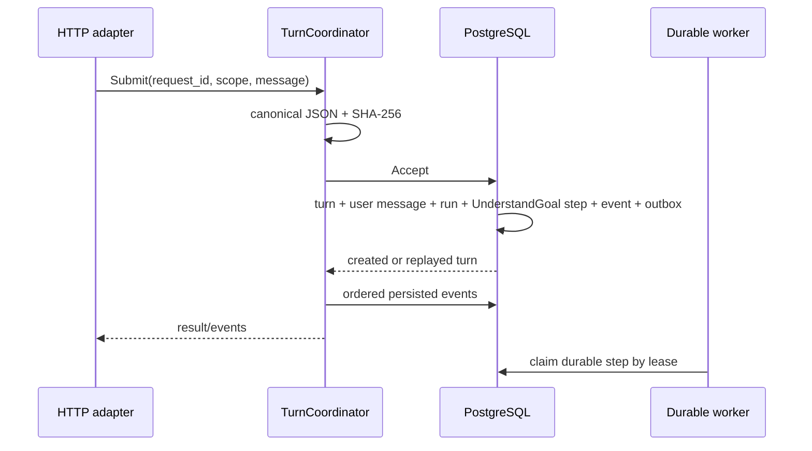

# Turn Pipeline Contract

## Ownership

`internal/agent/turn.Coordinator` owns request normalization, `request_id` idempotency, and transport-neutral event projection. It does not build prompts, call models, execute tools, or keep run state in memory. `storage/postgres/agentturn.Repository` owns the transaction boundary.

## Ingestion

The immutable idempotency key is `(idempotency_scope, request_id)`. Scope priority is workspace, organization, existing session, then global compatibility scope. Updating a newly created turn with its session ID cannot move or invalidate this key. Reusing a key with another canonical input hash returns `ErrIdempotencyConflict`.

The acceptance transaction creates the first assistant session when needed, its user message, one run linked by `turn_id`, the initial `UnderstandGoal` step, ordered turn events, and the outbox record. A notification may wake a worker later but is not part of acceptance correctness.

## Outcomes

Outcome envelopes contain a deterministic status, JSON-object output/error, and typed assistant/system messages. The coordinator canonicalizes JSON and hashes the envelope. The repository recomputes the hash at its trust boundary.

One transaction inserts the idempotent outcome fact, locks the session/turn, checks the deterministic state transition, appends assistant messages and ordered projection events, updates turn state, and inserts the outbox event. Replaying the same key/hash returns the existing outcome; changing content under the key fails.

## Streaming

Non-streaming callers use `Submit`. Streaming callers use `Stream`, which invokes `Submit` and projects only persisted events after the caller's sequence cursor. A broken observer/SSE connection never rolls back or mutates the turn. Reconnection repeats the same `request_id` with the last observed sequence and replays durable events.

## Compatibility and rollback

The old assistant endpoints remain active and `AGENT_RUNTIME_MODE=legacy` remains the default. Phase D introduces contracts and additive storage only; it does not enable the incomplete durable graph. Before migration, remove 018 and the unwired modules. After migration, disable new writers and retain additive audit tables/links; do not destructively contract them during incident rollback.
