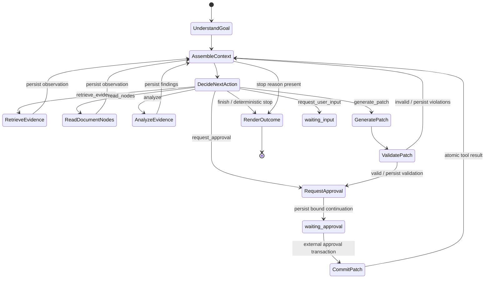

# Typed Orchestration Contract

Phase F replaces the fixed Planner → Retriever → Reviewer → Editor protocol with one durable Supervisor and typed execution nodes. It is an additive strangler implementation: `AGENT_RUNTIME_MODE=legacy` remains the default, the legacy task path is still the rollback path, and no public request is routed to this graph yet.

## Node graph



Every continuation is a strict `StepEnvelope` containing bounded typed state plus a JSON-object `node_input`. Full observations and large data are stored in `agent_observations`, ContextManifests, tool-call audit rows, or Artifacts; they are not copied into working state.

## Decision protocol

`DecideNextAction` accepts exactly one JSON object with no duplicate keys, unknown fields, or trailing values:

```json
{
  "action": "retrieve_evidence | read_nodes | analyze | generate_patch | request_user_input | request_approval | finish",
  "reason": "semantic rationale",
  "tool_name": "registered tool name or empty for semantic actions",
  "tool_input": {},
  "expected_observation": "bounded expected result",
  "confidence": 0.0
}
```

`ActionValidator` owns the action-to-node/tool map and prerequisites. The model cannot select a tool version, skip Patch validation, authorize a write, approve its own request, or transition directly to CommitPatch. Current deterministic mappings are `retrieve_evidence → retrieval.search@1.0.0`, `read_nodes → document.read_nodes@1.0.0`, and `request_approval → workflow.request_approval@1.0.0`.

## Plan–Act–Observe and context

Every model call, including goal understanding and final rendering, receives an immutable manifest from the shared ContextAssembler. Decide/analyze/generate/render load the exact persisted manifest rather than rebuilding current context. Each attempt carries one trace ID through the attempt row, model gateway, ToolRuntime call, and tool audit.

Tool nodes can run only from a persisted, schema-valid Decision. They execute through ToolRuntime, persist the complete structured result as an observation with content hash/provenance/tool-call reference, retain only a bounded observation reference in state, and assemble a new context before the next decision. Repeated hashes increment a no-progress counter.

## Deterministic stops and failures

The Supervisor stops or waits on goal completion, user input, external approval, repeated no-new-information, or terminal classified errors. The Durable Engine independently enforces run deadline, attempt and step timeout, cancellation, maximum attempts, step/tool counts, token budget, and cost budget. A validated Patch exits the generation loop and can proceed only through an approval decision. Retryable model and tool failures retain their typed category for Engine backoff; malformed model output is `invalid_input`.

## Approval continuation

`workflow.request_approval` persists only a pending fact. Its output contains a strict continuation bound to the validated Patch, approval ID, target tool/version, canonical resource scope, and target write idempotency key. An admin/owner API-side decision is not a Tool and is not model-callable.

For typed waiting rows, the approval repository atomically commits the human decision and either:

- approved: verifies the stored continuation, marks RequestApproval complete, inserts the unique CommitPatch step, queues the run, and writes the approval outbox event; or
- rejected: terminally fails the waiting step/run with `policy_blocked` and writes the rejection event.

The authorization fact is bound to workspace, run, tool/version, target idempotency key, and canonical resource hash. The stored `step_id` is approval-request provenance; execution occurs in the newly created CommitPatch step, so it is deliberately not treated as the target-step identity.

## Observations and shadow comparison

Migration `020_typed_orchestration.sql` adds immutable `agent_observations` and one idempotent `agent_shadow_comparisons` record per run. Observation insertion occurs in the same transaction as the step outcome, continuation steps, run transition, and outbox event. Public repository lookup returns the exact ordered observation payloads for audit and evaluation.

Shadow comparison hashes canonical JSON objects so key order cannot create false divergence. It records `matched`, `diverged`, or `unavailable`; a replay with different facts is an idempotency conflict. Phase F does not execute duplicate writes or route public traffic. Phase I will run the allowlisted read-only/shadow cohort and gate cutover on these comparison records.

## Deployment and rollback

Deploy migration 020 with the checksum migrator while retaining `AGENT_RUNTIME_MODE=legacy`. The new tables and code are expand-only and inert until a later authorized wiring/cutover. Before enabling a cohort, an authorized `_test`/staging database must pass the guarded observation, approval-resume, and shadow-round-trip tests.

Rollback by stopping typed workers and retaining or restoring `legacy` mode. Do not drop observation, approval, comparison, run, or outbox facts. Before migration execution, migration 020 and the unwired orchestration package can be removed from a candidate build; after execution, leave the additive tables in place.

## Phase boundary

Phase F does not provide the Phase G Canonical Document AST/expected-hash committer or the Phase H versioned EvidenceSet/fusion engine. The typed `patch.validate`, `patch.commit`, and retrieval tools remain adapters over existing backends until those phases replace their internals. Production durable traffic therefore remains fail-closed.
